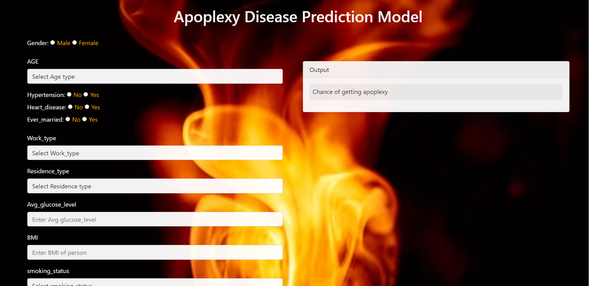

# 🫀 Apoplexy-Disease-Prediction

## 🪄 About
This is an End-to-End Machine Learning project. The project aims at developing a classification model for predicting whether a person will get Apoplexy based on his biographical data and Health condition.

The project was created using Python Flask framework and integrated with Web API. Deployed the application in Railway app.

Link for the application: https://apoplexy-disease-prediction-production.up.railway.app/

## 📈 DataSource

According to the World Health Organization (WHO) stroke or Apoplexy is the 2nd leading cause of death globally, responsible for approximately 11% of total deaths.
This dataset is used to predict whether a patient is likely to get Apoplexy based on the input parameters like gender, age, various diseases, and smoking status. Each row in the data provides relavant information about the patient. The target column is "apoplexy" which tells whether a person will have chance of getting apoplexy.

The datasource for this project was taken from Kaggle dataset Stroke Prediction Dataset.

Dataset download link: https://www.kaggle.com/datasets/fedesoriano/stroke-prediction-dataset

## 💻 Web UI

<a></a>

## 🖥️ Installation

### 🛠️ Requirement packages
* numpy  
* pandas
* matplotlib
* sklearn
* seaborn
* Flask
* gunicorn
* imblearn
* xgboost
* dill

### ⚙️ SetUp

1. Creating conda environment
 ``` 
 conda create -p venv python==3.7 -y 
 ```

2. For activating environment
```
"conda activate venv/"
```
3. For installing packages in requirements.txt
```
pip install -r requirements.txt
```

4. To add files to git
```
git add <file_name> => for adding single file to git.
git add . => for adding all the files to your local git.
```
5. To check the git status
```
git status
```
6. To create version/commit all the changes to git

```
git commit -m "Message"
```
7. To send version/changes to github.
```
git push origin main
```

## 📒 Notebooks

1. EDA & FeatureEngineering.ipynb

    In this Notebook, I have performed complete End-to-End Machine Learning process from DataIngestion to Data Evaluation
    * Steps Performed:
        1. Data Ingestion
        2. EDA
        3. Feature Engineering
        4. Feature Selection
        5. Sampling
        6. Model Training
        7. Best model using(AUC-ROC) curve<br>
<br>

2. Apoplexy Disease Prediction Model.ipynb

    In this Notebook, I have implemented all the steps performed in EDA & FeatureEngineering.ipynb notebook but using Pipeline. Which helps to build a model and used the Trained model for predicting the output.
